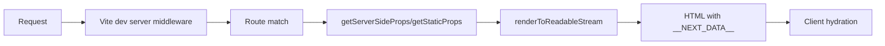
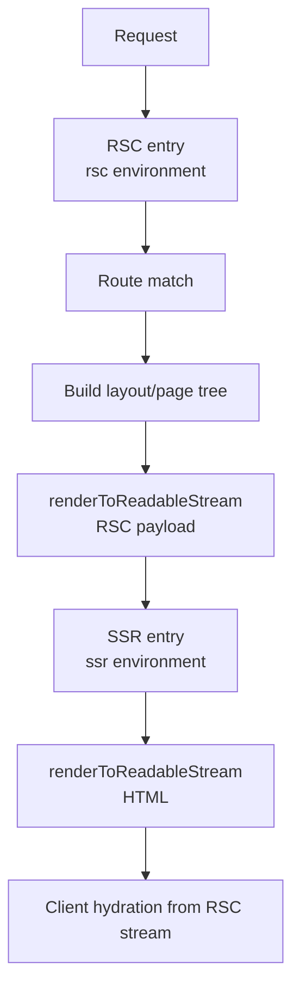

vinext is a Vite plugin that reimplements the Next.js API surface, allowing existing Next.js applications to run on a completely different toolchain. This page explains how vinext works under the hood.

## Core Architecture

vinext is a Vite plugin that performs four key functions:

<Steps>
  <Step title="Module Resolution">
    Resolves all `next/*` imports to local shim modules that reimplement the Next.js API using standard Web APIs and React primitives.
  </Step>
  <Step title="File-System Routing">
    Scans your `pages/` and `app/` directories to build a file-system router matching Next.js conventions.
  </Step>
  <Step title="Virtual Entry Generation">
    Generates virtual entry modules for the RSC, SSR, and browser environments that handle request routing, component rendering, and client hydration.
  </Step>
  <Step title="RSC Integration">
    Integrates with `@vitejs/plugin-rsc` for React Server Components — handling `"use client"` / `"use server"` directives, RSC stream serialization, and multi-environment builds.
  </Step>
</Steps>

The result is a standard Vite application that happens to be API-compatible with Next.js.

## Request Flow

### Pages Router Flow



The Pages Router flow is straightforward:

1. **Request arrives** at the Vite dev server middleware
2. **Route matching** finds the appropriate page component based on the URL
3. **Data fetching** executes `getServerSideProps` or `getStaticProps` if defined
4. **Rendering** calls React's `renderToReadableStream` with the `_app` and page components
5. **HTML generation** embeds serialized page props in `__NEXT_DATA__` script tag
6. **Client hydration** picks up the props and hydrates the React tree

### App Router Flow



The App Router flow involves two separate Vite environments:

1. **RSC entry** (runs in the `rsc` Vite environment with `react-server` condition)
   - Matches the URL to an app route
   - Builds the nested layout + page component tree
   - Renders to an RSC stream

2. **SSR entry** (runs in the `ssr` Vite environment)
   - Consumes the RSC stream
   - Renders to HTML with `renderToReadableStream`
   - Embeds RSC payload for client hydration

3. **Client hydration** picks up the RSC stream and hydrates interactive components

<Warning>
  **Critical architectural detail:** The RSC and SSR environments are **separate Vite module graphs with separate module instances**. Per-request state must be explicitly passed between them via the `handleSsr(rscStream, navContext)` call.
</Warning>

## Project Structure

```
packages/vinext/
  src/
    index.ts              # Main plugin — resolve aliases, config, virtual modules
    cli.ts                # vinext CLI (dev/build/start/deploy/init/check/lint)
    check.ts              # Compatibility scanner
    deploy.ts             # Cloudflare Workers deployment
    init.ts               # vinext init — one-command migration
    client/
      entry.ts            # Client-side hydration entry
    routing/
      pages-router.ts     # Pages Router file-system scanner
      app-router.ts       # App Router file-system scanner
    server/
      dev-server.ts       # Pages Router SSR request handler
      app-dev-server.ts   # App Router RSC entry generator
      prod-server.ts      # Production server with compression
      api-handler.ts      # Pages Router API routes
      isr-cache.ts        # ISR cache layer
      middleware.ts       # middleware.ts / proxy.ts runner
      metadata-routes.ts  # File-based metadata route scanner
      instrumentation.ts  # instrumentation.ts support
    cloudflare/
      kv-cache-handler.ts # Cloudflare KV-backed CacheHandler for ISR
    shims/                # One file per next/* module (33 shims + 6 internal)
    build/
      static-export.ts    # output: 'export' support
    utils/
      project.ts          # Shared project utilities
    config/
      next-config.ts      # next.config.js loader
      config-matchers.ts  # Config matching utilities
```

## Module Shims

Every `next/*` import is shimmed to a Vite-compatible implementation:

<CodeGroup>
```typescript packages/vinext/src/shims/link.tsx
// Simplified example of next/link shim
import React from 'react';
import { useRouter } from './navigation.js';

export default function Link({ href, children, ...props }) {
  const router = useRouter();
  
  const handleClick = (e) => {
    e.preventDefault();
    router.push(href);
  };
  
  return <a href={href} onClick={handleClick} {...props}>{children}</a>;
}
```

```typescript packages/vinext/src/shims/navigation.ts
// Simplified example of next/navigation shim
import { AsyncLocalStorage } from 'node:async_hooks';

const navigationContext = new AsyncLocalStorage();

export function usePathname() {
  const ctx = navigationContext.getStore();
  return ctx?.pathname ?? '/';
}

export function useRouter() {
  return {
    push: (href) => {
      // Client-side navigation implementation
    },
    // ... other router methods
  };
}
```
</CodeGroup>

All 33 `next/*` modules are implemented this way, providing the full Next.js API surface on top of Vite.

## Division of Responsibilities

### What `@vitejs/plugin-rsc` Handles

The RSC plugin from Vite handles the React Server Components infrastructure:

- Bundler transforms for `"use client"` / `"use server"` directives
- RSC stream serialization (wraps `react-server-dom-webpack`)
- Multi-environment builds (RSC/SSR/Client)
- CSS code-splitting and auto-injection
- HMR for server components
- Bootstrap script injection for client hydration

### What vinext Handles

vinext handles everything else that makes it Next.js:

- File-system routing (scanning `app/` and `pages/` directories)
- Request lifecycle (middleware, headers, redirects, rewrites, then route handling)
- Layout nesting and React tree construction
- Client-side navigation and prefetching
- Caching (ISR, `"use cache"`, fetch cache)
- All `next/*` module shims
- CLI commands (dev, build, deploy, etc.)

## Virtual Modules

vinext generates several virtual modules that serve as entry points:

| Module | Purpose | Environment |
|--------|---------|-------------|
| `virtual:vinext-rsc-entry` | RSC request handler for App Router | `rsc` |
| `virtual:vinext-app-ssr-entry` | SSR entry for App Router | `ssr` |
| `virtual:vinext-app-browser-entry` | Client hydration for App Router | `client` |
| `virtual:vinext-server-entry` | Pages Router SSR handler | `ssr` |
| `virtual:vinext-client-entry` | Client hydration for Pages Router | `client` |

These virtual modules are dynamically generated based on your file-system routes and imported by the Vite plugin.

<Note>
  Virtual module IDs are prefixed with `\0` when resolved by Vite. The `resolveId` hook must handle both unprefixed and prefixed forms.
</Note>

## Production Builds

Production builds require special handling due to the multi-environment architecture:

```typescript
import { createBuilder } from 'vite';

const builder = await createBuilder({
  root: process.cwd(),
  plugins: [vinext(), rsc({ /* ... */ })],
});

await builder.buildApp();
```

Calling `buildApp()` triggers the RSC plugin's 5-step build sequence:

1. **RSC build** — Server components (react-server condition)
2. **SSR build** — SSR entry and server-side client components
3. **Client build** — Browser bundle with client components
4. **RSC client manifest** — Mapping of client component IDs
5. **SSR client manifest** — For SSR environment to reference client chunks

<Warning>
  You **must** use `createBuilder()` + `builder.buildApp()` for production builds. Calling `build()` from the Vite JS API directly doesn't trigger the multi-environment pipeline.
</Warning>

## Deployment Target

Cloudflare Workers is the primary deployment target:

```typescript
import { cloudflare } from '@cloudflare/vite-plugin';

export default defineConfig({
  plugins: [
    vinext(),
    rsc({
      entries: {
        rsc: 'virtual:vinext-rsc-entry',
        ssr: 'virtual:vinext-app-ssr-entry',
        client: 'virtual:vinext-app-browser-entry',
      },
    }),
    cloudflare({
      viteEnvironment: { name: 'rsc', childEnvironments: ['ssr'] },
    }),
  ],
});
```

The `vinext deploy` command handles the full build-and-deploy pipeline, including:

- Auto-generating configuration files (`vite.config.ts`, `wrangler.jsonc`, `worker/index.ts`)
- Detecting and fixing common migration issues
- Building the application for Workers
- Deploying to Cloudflare

See the [Deployment guide](/guides/cloudflare-workers) for details.

## Next Steps

<CardGroup cols={2}>
  <Card title="File-System Routing" icon="folder-tree" href="/concepts/routing">
    Learn how vinext scans your pages/ and app/ directories
  </Card>
  <Card title="Server Components" icon="server" href="/concepts/server-components">
    Understand RSC integration and rendering flow
  </Card>
  <Card title="Caching & ISR" icon="database" href="/concepts/caching">
    Explore the pluggable cache architecture
  </Card>
  <Card title="API Coverage" icon="check" href="/advanced/api-coverage">
    See which Next.js APIs are supported
  </Card>
</CardGroup>