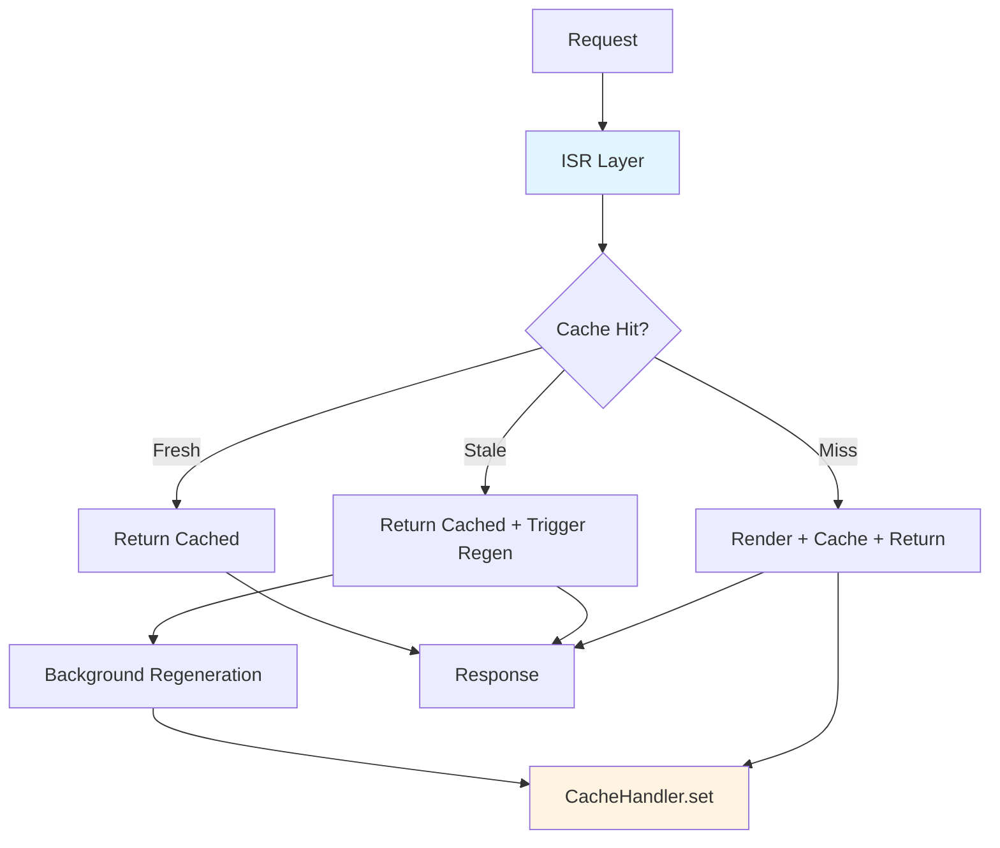

vinext implements Incremental Static Regeneration (ISR) and caching using a pluggable architecture. The default in-memory cache works out of the box, and you can swap in production backends like Cloudflare KV, Redis, or DynamoDB.

## Cache Architecture

vinext's caching system has two layers:

<Steps>
  <Step title="CacheHandler (Storage Layer)">
    A pluggable key-value store matching Next.js 16's `CacheHandler` interface. Handles get/set operations with metadata.
  </Step>
  <Step title="ISR Layer (Semantics)">
    Sits above the CacheHandler and implements stale-while-revalidate, background regeneration, and tag-based invalidation.
  </Step>
</Steps>



### CacheHandler Interface

The `CacheHandler` is a simple key-value store:

```typescript packages/vinext/src/shims/cache.ts
export abstract class CacheHandler {
  abstract get(key: string): Promise<CacheHandlerValue | null>;
  
  abstract set(
    key: string,
    data: IncrementalCacheValue,
    options: { revalidate?: number; tags?: string[] }
  ): Promise<void>;
  
  abstract revalidateTag(tag: string): Promise<void>;
}

export interface CacheHandlerValue {
  value: IncrementalCacheValue;
  cacheState?: 'fresh' | 'stale';
  lastModified?: number;
}

export type IncrementalCacheValue =
  | CachedPagesValue    // Pages Router HTML + pageData
  | CachedAppPageValue  // App Router HTML + RSC stream
  | CachedRouteValue;   // Route handler response
```

### ISR Layer Implementation

The ISR layer wraps the CacheHandler:

```typescript packages/vinext/src/server/isr-cache.ts
export async function isrGet(key: string): Promise<ISRCacheEntry | null> {
  const handler = getCacheHandler();
  const result = await handler.get(key);
  if (!result || !result.value) return null;

  return {
    value: result,
    isStale: result.cacheState === "stale",
  };
}

export async function isrSet(
  key: string,
  data: IncrementalCacheValue,
  revalidateSeconds: number,
  tags?: string[],
): Promise<void> {
  const handler = getCacheHandler();
  await handler.set(key, data, {
    revalidate: revalidateSeconds,
    tags: tags ?? [],
  });
}
```

## Stale-While-Revalidate

ISR returns stale content immediately while regenerating in the background:

```typescript
const cached = await isrGet(cacheKey);

if (cached?.isStale) {
  // Serve stale content immediately
  respondWith(cached.value);
  
  // Trigger background regeneration
  triggerBackgroundRegeneration(cacheKey, async () => {
    const fresh = await renderPage();
    await isrSet(cacheKey, fresh, revalidateSeconds);
  });
} else if (cached) {
  // Fresh hit — serve immediately
  respondWith(cached.value);
} else {
  // Cache miss — render, cache, serve
  const rendered = await renderPage();
  await isrSet(cacheKey, rendered, revalidateSeconds);
  respondWith(rendered);
}
```

### Deduplication

Multiple concurrent requests for the same stale key only trigger **one** regeneration:

```typescript packages/vinext/src/server/isr-cache.ts
const pendingRegenerations = new Map<string, Promise<void>>();

export function triggerBackgroundRegeneration(
  key: string,
  renderFn: () => Promise<void>,
): void {
  if (pendingRegenerations.has(key)) return; // Already regenerating

  const promise = renderFn()
    .catch((err) => {
      console.error(`[vinext] ISR regeneration failed for ${key}:`, err);
    })
    .finally(() => {
      pendingRegenerations.delete(key);
    });

  pendingRegenerations.set(key, promise);
}
```

This prevents "thundering herd" — a spike in traffic to a stale page only renders it once.

## Pages Router ISR

Enable ISR by returning `revalidate` from `getStaticProps`:

```tsx pages/blog/[slug].tsx
export async function getStaticProps({ params }) {
  const post = await db.getPost(params.slug);
  
  return {
    props: { post },
    revalidate: 60, // Revalidate every 60 seconds
  };
}

export async function getStaticPaths() {
  const posts = await db.getAllPosts();
  
  return {
    paths: posts.map(p => ({ params: { slug: p.slug } })),
    fallback: 'blocking', // Render on-demand for missing paths
  };
}

export default function Post({ post }) {
  return <article>{post.content}</article>;
}
```

### Fallback Modes

| Mode | Behavior |
|------|----------|
| `false` | Only pre-rendered paths exist. 404 for others. |
| `true` | Serve fallback UI while rendering new paths. |
| `'blocking'` | Server-render new paths (no fallback UI). |

```tsx
export async function getStaticPaths() {
  return {
    paths: [{ params: { id: '1' } }],
    fallback: 'blocking',
  };
}
```

With `fallback: 'blocking'`:

1. Request `/posts/2` (not pre-rendered)
2. vinext renders the page on-demand
3. Caches the result with `revalidate` TTL
4. Future requests serve from cache with stale-while-revalidate

## App Router ISR

Enable ISR with route segment config:

```tsx app/blog/[slug]/page.tsx
// Revalidate every 60 seconds
export const revalidate = 60;

export default async function Post({ params }) {
  const { slug } = await params;
  const post = await db.getPost(slug);
  
  return <article>{post.content}</article>;
}
```

### Dynamic Rendering

Control when pages render:

```tsx app/dashboard/page.tsx
// Force static (at build time)
export const dynamic = 'force-static';

// Force dynamic (on every request)
export const dynamic = 'force-dynamic';

// Auto (static if possible, dynamic if needed)
export const dynamic = 'auto'; // default
```

## Tag-Based Revalidation

Invalidate cache entries by tag:

```tsx app/posts/[id]/page.tsx
import { unstable_cache } from 'next/cache';

const getCachedPost = unstable_cache(
  async (id) => db.getPost(id),
  ['post'],
  { tags: [`post-${id}`] }
);

export default async function Post({ params }) {
  const { id } = await params;
  const post = await getCachedPost(id);
  
  return <article>{post.content}</article>;
}
```

Invalidate when data changes:

```tsx app/actions.ts
"use server";

import { revalidateTag } from 'next/cache';

export async function updatePost(id: string, data: any) {
  await db.updatePost(id, data);
  
  // Invalidate cache for this post
  revalidateTag(`post-${id}`);
}
```

### Path-Based Revalidation

```tsx
import { revalidatePath } from 'next/cache';

export async function createPost(data: any) {
  await db.createPost(data);
  
  // Invalidate all blog pages
  revalidatePath('/blog', 'page'); // Just /blog
  revalidatePath('/blog', 'layout'); // /blog and /blog/*
}
```

## `"use cache"` Directive

Next.js 16 introduced `"use cache"` for granular caching:

### Function-Level Caching

```tsx app/components/RecentPosts.tsx
import { cache } from 'react';
import { cacheLife } from 'next/cache';

const getRecentPosts = cache(async () => {
  "use cache";
  cacheLife('hours');
  
  return await db.query('SELECT * FROM posts ORDER BY date DESC LIMIT 10');
});

export default async function RecentPosts() {
  const posts = await getRecentPosts();
  
  return (
    <ul>
      {posts.map(p => <li key={p.id}>{p.title}</li>)}
    </ul>
  );
}
```

### File-Level Caching

```tsx app/lib/posts.ts
"use cache";

import { cacheLife, cacheTag } from 'next/cache';

export async function getPost(id: string) {
  cacheLife('days');
  cacheTag(`post-${id}`);
  
  return await db.getPost(id);
}
```

### Cache Profiles

Define reusable cache durations:

```typescript next.config.js
module.exports = {
  experimental: {
    cacheLife: {
      hours: { stale: 3600, revalidate: 7200 },
      days: { stale: 86400, revalidate: 604800 },
    },
  },
};
```

## Cloudflare KV Cache Handler

For production on Cloudflare Workers, use the KV cache handler:

```typescript worker/index.ts
import { KVCacheHandler } from 'vinext/cloudflare';
import { setCacheHandler } from 'next/cache';

export default {
  async fetch(request, env) {
    // Set KV as cache backend
    setCacheHandler(new KVCacheHandler(env.CACHE_KV));
    
    // Handle request
    return handleRequest(request);
  },
};
```

### Binding KV Namespace

Add to `wrangler.jsonc`:

```json wrangler.jsonc
{
  "name": "my-app",
  "main": "worker/index.ts",
  "compatibility_date": "2024-01-01",
  "kv_namespaces": [
    {
      "binding": "CACHE_KV",
      "id": "your-kv-namespace-id"
    }
  ]
}
```

Create the namespace:

```bash
wrangler kv:namespace create CACHE_KV
```

### KV Implementation

```typescript packages/vinext/src/cloudflare/kv-cache-handler.ts
export class KVCacheHandler extends CacheHandler {
  constructor(private kv: KVNamespace) {
    super();
  }

  async get(key: string): Promise<CacheHandlerValue | null> {
    const data = await this.kv.get(key, 'json');
    if (!data) return null;
    
    const { value, expiresAt, tags } = data;
    const now = Date.now();
    
    return {
      value,
      cacheState: now > expiresAt ? 'stale' : 'fresh',
      lastModified: data.lastModified,
    };
  }

  async set(
    key: string,
    value: IncrementalCacheValue,
    { revalidate, tags }: { revalidate?: number; tags?: string[] }
  ): Promise<void> {
    const now = Date.now();
    const expiresAt = revalidate ? now + revalidate * 1000 : null;
    
    await this.kv.put(key, JSON.stringify({
      value,
      expiresAt,
      tags: tags ?? [],
      lastModified: now,
    }));
    
    // Store tag → keys mapping for revalidateTag
    for (const tag of tags ?? []) {
      await this.addTagKey(tag, key);
    }
  }

  async revalidateTag(tag: string): Promise<void> {
    const keys = await this.getTagKeys(tag);
    await Promise.all(keys.map(k => this.kv.delete(k)));
  }
}
```

## Custom Cache Handlers

Implement the `CacheHandler` interface for other backends:

```typescript lib/redis-cache.ts
import { CacheHandler } from 'next/cache';
import Redis from 'ioredis';

export class RedisCacheHandler extends CacheHandler {
  private redis: Redis;
  
  constructor(redisUrl: string) {
    super();
    this.redis = new Redis(redisUrl);
  }
  
  async get(key: string) {
    const data = await this.redis.get(key);
    if (!data) return null;
    
    const { value, expiresAt } = JSON.parse(data);
    const now = Date.now();
    
    return {
      value,
      cacheState: now > expiresAt ? 'stale' : 'fresh',
    };
  }
  
  async set(key: string, value: any, { revalidate, tags }) {
    const now = Date.now();
    const expiresAt = revalidate ? now + revalidate * 1000 : null;
    
    await this.redis.set(key, JSON.stringify({ value, expiresAt, tags }));
    
    // Set Redis TTL (stale entries are kept for stale-while-revalidate)
    if (revalidate) {
      await this.redis.expire(key, revalidate * 2);
    }
  }
  
  async revalidateTag(tag: string) {
    // Scan for keys with this tag and delete
    const keys = await this.redis.keys(`*`);
    for (const key of keys) {
      const data = await this.redis.get(key);
      if (data) {
        const { tags } = JSON.parse(data);
        if (tags?.includes(tag)) {
          await this.redis.del(key);
        }
      }
    }
  }
}
```

Register it:

```typescript
import { setCacheHandler } from 'next/cache';
import { RedisCacheHandler } from './lib/redis-cache';

setCacheHandler(new RedisCacheHandler(process.env.REDIS_URL));
```

## Cache Key Generation

vinext generates cache keys from the router type and pathname:

```typescript packages/vinext/src/server/isr-cache.ts
export function isrCacheKey(router: 'pages' | 'app', pathname: string): string {
  const normalized = pathname === "/" ? "/" : pathname.replace(/\/$/, "");
  const key = `${router}:${normalized}`;
  
  // Hash long pathnames to stay within KV key-length limits (512 bytes)
  if (key.length <= 200) return key;
  return `${router}:__hash:${fnv1a64(normalized)}`;
}
```

Examples:

- `pages:/` → root page
- `pages:/blog/hello-world` → blog post
- `app:/dashboard/analytics` → app route
- `app:__hash:a3f2b91c` → long pathname (hashed)

## Next Steps

<CardGroup cols={2}>
  <Card title="Deployment" icon="rocket" href="/deploy/cloudflare">
    Deploy to Cloudflare Workers with KV cache
  </Card>
  <Card title="Server Components" icon="server" href="/concepts/server-components">
    Learn about RSC rendering
  </Card>
  <Card title="Server Actions" icon="bolt" href="/api/server-actions">
    Mutate data and revalidate cache
  </Card>
  <Card title="Architecture" icon="diagram-project" href="/concepts/architecture">
    Understand vinext's architecture
  </Card>
</CardGroup>