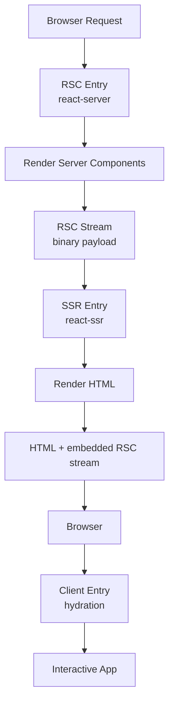

vinext implements React Server Components (RSC) for the App Router through integration with `@vitejs/plugin-rsc`. This enables the full App Router experience: server-first rendering, streaming, server actions, and automatic code-splitting.

## How RSC Works in vinext

RSC requires coordination between three separate Vite environments:

<Steps>
  <Step title="RSC Environment">
    Runs with the `react-server` condition. Renders server components to an RSC stream (binary format).
  </Step>
  <Step title="SSR Environment">
    Runs on the server with the standard `react-ssr` condition. Consumes the RSC stream and renders HTML.
  </Step>
  <Step title="Client Environment">
    Runs in the browser. Hydrates interactive components from the RSC stream.
  </Step>
</Steps>

### Multi-Environment Architecture



<Warning>
  **Critical:** The RSC and SSR environments have **separate module graphs**. They do not share state. Per-request context (pathname, searchParams, params) must be explicitly passed via `handleSsr(rscStream, navContext)`.
</Warning>

## Server vs Client Components

### Server Components (default)

By default, all components in the App Router are **Server Components**:

```tsx app/blog/page.tsx
// This is a Server Component (no directive needed)
export default async function BlogPage() {
  const posts = await db.query('SELECT * FROM posts');
  
  return (
    <div>
      <h1>Blog Posts</h1>
      {posts.map(post => (
        <article key={post.id}>
          <h2>{post.title}</h2>
          <p>{post.excerpt}</p>
        </article>
      ))}
    </div>
  );
}
```

Server Components can:

- ✅ Use async/await for data fetching
- ✅ Access backend resources (databases, file system, etc.)
- ✅ Keep sensitive data server-side (API keys, credentials)
- ✅ Reduce client bundle size (don't ship to browser)
- ❌ Use hooks like `useState`, `useEffect`
- ❌ Use browser APIs
- ❌ Attach event handlers

### Client Components

Mark components with `"use client"` to make them interactive:

```tsx app/components/Counter.tsx
"use client";

import { useState } from 'react';

export default function Counter() {
  const [count, setCount] = useState(0);
  
  return (
    <button onClick={() => setCount(count + 1)}>
      Count: {count}
    </button>
  );
}
```

Client Components can:

- ✅ Use React hooks (`useState`, `useEffect`, etc.)
- ✅ Attach event handlers
- ✅ Use browser APIs
- ✅ Use navigation hooks (`usePathname`, `useSearchParams`, etc.)
- ❌ Use async component functions
- ❌ Access server-only APIs directly

### Composing Server and Client Components

```tsx app/dashboard/page.tsx
// Server Component (default)
import ClientChart from './ClientChart';
import ServerStats from './ServerStats';

export default async function Dashboard() {
  const data = await fetchAnalytics();
  
  return (
    <div>
      <h1>Dashboard</h1>
      {/* Server Component — renders on server */}
      <ServerStats data={data} />
      
      {/* Client Component — interactive chart */}
      <ClientChart data={data} />
    </div>
  );
}
```

```tsx app/dashboard/ClientChart.tsx
"use client";

import { useState } from 'react';

export default function ClientChart({ data }) {
  const [timeRange, setTimeRange] = useState('7d');
  
  return (
    <div>
      <select value={timeRange} onChange={e => setTimeRange(e.target.value)}>
        <option value="7d">Last 7 days</option>
        <option value="30d">Last 30 days</option>
      </select>
      <Chart data={data} range={timeRange} />
    </div>
  );
}
```

<Note>
  You can pass Server Components as children to Client Components:
  
  ```tsx
  <ClientWrapper>
    <ServerComponent /> {/* ✅ Works */}
  </ClientWrapper>
  ```
</Note>

## The RSC Entry

vinext generates a virtual RSC entry module that handles routing and rendering:

```typescript packages/vinext/src/server/app-dev-server.ts
export function generateRscEntry(
  appDir: string,
  routes: AppRoute[],
  middlewarePath?: string | null,
  metadataRoutes?: MetadataFileRoute[],
  globalErrorPath?: string | null,
  basePath?: string,
  trailingSlash?: boolean,
  config?: AppRouterConfig,
): string {
  // Build import map for all page and layout files
  const imports: string[] = [];
  const importMap: Map<string, string> = new Map();
  
  // Pre-register all modules
  for (const route of routes) {
    if (route.pagePath) getImportVar(route.pagePath);
    if (route.routePath) getImportVar(route.routePath);
    for (const layout of route.layouts) getImportVar(layout);
    for (const tmpl of route.templates) getImportVar(tmpl);
    // ... register all route files
  }
  
  // Generate entry code that:
  // 1. Matches URL to route
  // 2. Builds nested layout tree
  // 3. Renders to RSC stream
  // ...
}
```

The generated entry exports a default handler:

```typescript virtual:vinext-rsc-entry (generated)
import * as mod_0 from '/app/layout.tsx';
import * as mod_1 from '/app/page.tsx';
import * as mod_2 from '/app/blog/layout.tsx';
import * as mod_3 from '/app/blog/[slug]/page.tsx';
// ... all route files

const routes = [
  {
    pattern: '/',
    page: mod_1,
    layouts: [mod_0],
    // ...
  },
  {
    pattern: '/blog/:slug',
    page: mod_3,
    layouts: [mod_0, mod_2],
    // ...
  },
];

export default async function handleRequest(request: Request) {
  const url = new URL(request.url);
  const route = matchRoute(url.pathname, routes);
  
  // Build React tree: layouts wrapping page
  const tree = buildComponentTree(route);
  
  // Render to RSC stream
  const stream = renderToReadableStream(tree);
  
  return new Response(stream);
}
```

## Rendering Flow

### 1. Route Matching

The RSC entry matches the URL to a route:

```typescript
const route = matchAppRoute(pathname, routes);
if (!route) {
  return notFound(); // Triggers not-found.tsx
}
```

### 2. Layout Tree Construction

Layouts nest from root to leaf:

```typescript
function buildComponentTree(route: AppRoute, params: Record<string, any>) {
  let tree = route.page.default({ params });
  
  // Wrap with templates (re-mount on navigation)
  for (const template of route.templates.reverse()) {
    tree = template.default({ children: tree });
  }
  
  // Wrap with layouts (persist across navigation)
  for (const layout of route.layouts.reverse()) {
    tree = layout.default({ children: tree });
  }
  
  return tree;
}
```

For a route like `/blog/hello-world` with:

```
app/
  layout.tsx
  blog/
    layout.tsx
    [slug]/
      page.tsx
```

The tree is:

```jsx
<RootLayout>
  <BlogLayout>
    <BlogPostPage params={{ slug: 'hello-world' }} />
  </BlogLayout>
</RootLayout>
```

### 3. RSC Stream Generation

React renders the tree to a binary RSC stream:

```typescript
import { renderToReadableStream } from 'react-server-dom-webpack/server';

const stream = renderToReadableStream(tree, manifest);
```

The manifest maps client component IDs to their JavaScript chunks.

### 4. SSR Consumption

The SSR entry receives the RSC stream and renders HTML:

```typescript virtual:vinext-app-ssr-entry (generated)
import { createFromReadableStream } from 'react-server-dom-webpack/client';
import { renderToReadableStream } from 'react-dom/server';

export async function handleSsr(rscStream, navContext) {
  // Set navigation context for usePathname, useSearchParams, etc.
  setNavigationContext(navContext);
  
  // Consume RSC stream to get React elements
  const root = await createFromReadableStream(rscStream);
  
  // Render to HTML
  const htmlStream = await renderToReadableStream(root, {
    bootstrapScripts: ['/client.js'],
  });
  
  return htmlStream;
}
```

### 5. Client Hydration

The browser receives HTML with an embedded RSC stream and hydrates:

```typescript virtual:vinext-app-browser-entry (generated)
import { createRoot, hydrateRoot } from 'react-dom/client';
import { createFromFetch } from 'react-server-dom-webpack/client';

// Extract RSC stream from HTML
const rscStream = new ReadableStream(/* ... from script tag */);

// Recreate React tree from stream
const root = await createFromFetch(fetch('/rsc'));

// Hydrate
hydrateRoot(document, root);
```

## Server Actions

Server actions are functions marked with `"use server"` that run on the server:

```tsx app/actions.ts
"use server";

import { revalidatePath } from 'next/cache';

export async function createPost(formData: FormData) {
  const title = formData.get('title');
  const content = formData.get('content');
  
  await db.insert('posts', { title, content });
  
  revalidatePath('/blog');
}
```

Use in Client Components:

```tsx app/NewPostForm.tsx
"use client";

import { createPost } from './actions';

export default function NewPostForm() {
  return (
    <form action={createPost}>
      <input name="title" required />
      <textarea name="content" required />
      <button type="submit">Create Post</button>
    </form>
  );
}
```

When the form submits:

1. Browser sends POST request to `/_vinext/action/[hash]`
2. vinext deserializes the action reference and calls the server function
3. Server action runs with FormData
4. Response triggers re-render with updated data

<Note>
  Server actions support `redirect()`, `cookies()`, and `headers()` for full request control.
</Note>

## Streaming and Suspense

RSC enables progressive rendering with Suspense:

```tsx app/dashboard/page.tsx
import { Suspense } from 'react';
import SlowComponent from './SlowComponent';

export default function Dashboard() {
  return (
    <div>
      <h1>Dashboard</h1>
      
      <Suspense fallback={<Skeleton />}>
        <SlowComponent />
      </Suspense>
    </div>
  );
}
```

vinext streams the HTML:

1. Initial HTML with `<h1>` and skeleton
2. When `SlowComponent` resolves, stream additional HTML
3. Browser inserts content without full page reload

Loading files provide automatic Suspense boundaries:

```tsx app/dashboard/loading.tsx
export default function Loading() {
  return <Skeleton />;
}
```

Equivalent to wrapping the page in Suspense:

```tsx
<Suspense fallback={<Loading />}>
  <Page />
</Suspense>
```

## Metadata API

Generate `<head>` tags from Server Components:

```tsx app/blog/[slug]/page.tsx
import type { Metadata } from 'next';

export async function generateMetadata({ params }): Promise<Metadata> {
  const { slug } = await params;
  const post = await db.getPost(slug);
  
  return {
    title: post.title,
    description: post.excerpt,
    openGraph: {
      images: [post.coverImage],
    },
  };
}

export default async function Post({ params }) {
  const { slug } = await params;
  const post = await db.getPost(slug);
  
  return <article>{post.content}</article>;
}
```

vinext collects metadata during RSC rendering and injects it into the HTML `<head>`.

## Configuration

Enable RSC by adding `@vitejs/plugin-rsc` to your Vite config:

```typescript vite.config.ts
import { defineConfig } from 'vite';
import vinext from 'vinext';
import rsc from '@vitejs/plugin-rsc';

export default defineConfig({
  plugins: [
    vinext(),
    rsc({
      entries: {
        rsc: 'virtual:vinext-rsc-entry',
        ssr: 'virtual:vinext-app-ssr-entry',
        client: 'virtual:vinext-app-browser-entry',
      },
    }),
  ],
});
```

For Cloudflare Workers deployment:

```typescript vite.config.ts
import { cloudflare } from '@cloudflare/vite-plugin';

export default defineConfig({
  plugins: [
    vinext(),
    rsc({
      entries: {
        rsc: 'virtual:vinext-rsc-entry',
        ssr: 'virtual:vinext-app-ssr-entry',
        client: 'virtual:vinext-app-browser-entry',
      },
    }),
    cloudflare({
      viteEnvironment: { name: 'rsc', childEnvironments: ['ssr'] },
    }),
  ],
});
```

## Limitations

<Warning>
  vinext's RSC implementation has some differences from Next.js:
  
  - **Native Node modules** (sharp, resvg) crash in dev mode but work in production builds
  - **`useSelectedLayoutSegment(s)`** derives segments from pathname rather than being truly layout-aware
  - **Dynamic OG images** using native modules work in production but not dev
</Warning>

## Next Steps

<CardGroup cols={2}>
  <Card title="Caching & ISR" icon="database" href="/concepts/caching">
    Learn about the pluggable cache architecture
  </Card>
  <Card title="Server Actions" icon="bolt" href="/api/server-actions">
    Deep dive into server actions
  </Card>
  <Card title="Metadata" icon="file-code" href="/api/metadata">
    Generate SEO-friendly meta tags
  </Card>
  <Card title="Deployment" icon="rocket" href="/deploy/cloudflare">
    Deploy RSC apps to Cloudflare Workers
  </Card>
</CardGroup>